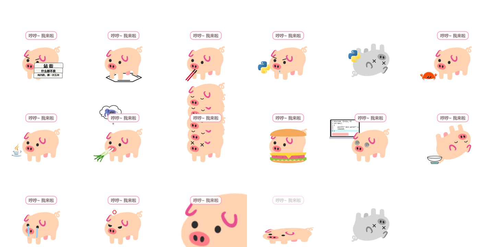

# 小猪桌宠 PigPet

一只住在 Windows 桌面上的 🐖。形象来自 Google Noto Emoji 的 `1f416`，待机动画用的是 Google 官方的 Noto Animated Emoji。基于 .NET 10 WPF。



## 功能

- **官方慵懒动画**：按官方文件里的 `rest` 标记播放一遍后停在休息姿势
- **动作**：呼吸、散步、翻滚、跳跃、转圈、抖动、睡觉
- **物理**：拖起来像钟摆一样晃，甩出去有重力、反弹、滚动、撞击压扁
- **17 种表情包形态**：站街、苯猪、我吃一点、猪吃蛇 / 蛇咬猪、猪吃螃蟹、猪喝咖啡、猪装象、在群友身上睡觉、汉堡猪、猪写代码、白吃 token 的猪、哭哭猪、生气猪、?!猪猪!?、摊平猪、死猪
- **摔死**：甩得太猛砸到地上或墙上会直接变成死猪抽搐几秒，再“诈尸”爬起来
- **猪群**：
  - 自我复制、一键分裂出指定数量（最多 50 只）
  - 再次运行 exe 会从天上掉下一只新猪
  - 合作动作：串门贴贴、叠罗汉、追逐、两猪对峙、合体（收回克隆），甩一只猪去撞另一只会把它撞飞
- **配置**：右键小猪或双击托盘图标打开设置，保存后立即生效，配置文件在 `%APPDATA%\PigPet\config.json`

## 操作

| 操作 | 效果 |
|---|---|
| 单击 | 冒爱心 + 随机动作 |
| 双击 | 翻滚 |
| 拖动 / 甩 | 拎起来晃，松手按速度飞出去 |
| 右键 | 打开设置 |
| 托盘菜单 | 动作、形态、猪群、暂停、点击穿透、退出 |

命令行可以让正在运行的程序执行动作：

```bash
PigPet.exe --play burst:10     # 一键分裂 10 只
PigPet.exe --play duel         # 两猪对峙
PigPet.exe --play form:peek    # 指定形态
```

## 构建

需要 .NET 10 SDK。

```bash
dotnet run                                  # 调试运行
dotnet publish -c Release -o publish        # 打包成自带运行时的单个 exe
```

开发辅助：
- `PigPet.exe --snapshot <目录>`：把每个形态渲染成 PNG
- 设置环境变量 `PIGPET_LOG=<文件>`：记录每只猪的动作日志

## 素材来源与授权

本项目代码以外的素材版权归各自所有者：

| 素材 | 来源 | 授权 |
|---|---|---|
| `assets/pig-lottie.json` | [Noto Animated Emoji](https://googlefonts.github.io/noto-emoji-animation/) | CC BY 4.0，© Google |
| `assets/pig_1f416.png` | Google Noto Emoji（Android 11），经 [Emojipedia](https://emojipedia.org/google/android-11.0/pig) | Apache 2.0，© Google |
| `assets/logos/python-logo-only.svg` | [python.org 官方 logo](https://www.python.org/community/logos/) | Python 商标归 Python Software Foundation 所有 |
| `assets/logos/rustacean-flat-happy.svg` | [rustacean.net](https://rustacean.net/)（Ferris） | 作者声明放弃版权（Public Domain） |
| `assets/logos/php-logo.svg` | [php.net 官方 logo](https://www.php.net/download-logos.php) | CC BY-SA 4.0 |
| `assets/logos/java-logo.svg` | [Wikimedia Commons](https://en.wikipedia.org/wiki/File:Java_programming_language_logo.svg) | Java 商标归 Oracle 所有 |

各形态的创意来自网络流行的 Noto 猪表情包，道具和表情均为矢量重绘。各 logo 仅作趣味用途，不代表相关组织认可本项目。
